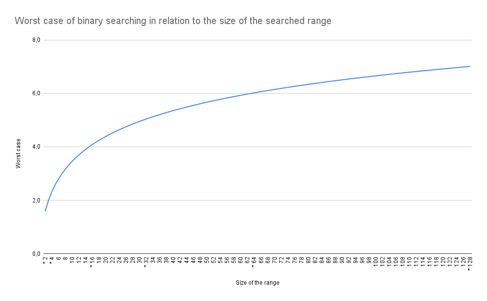

# 1. Content

- [1. Content](#1-content)
	- [1.1. A general description](#11-a-general-description)
		- [1.1.1. Definitions](#111-definitions)
			- [1.1.1.1. The pairs](#1111-the-pairs)
			- [1.1.1.2. The elements](#1112-the-elements)
			- [1.1.1.3. The values](#1113-the-values)
		- [1.1.2. Data structures](#112-data-structures)
	- [1.2. Making pairs](#12-making-pairs)
		- [1.2.1. But why are we making pairs ?](#121-but-why-are-we-making-pairs-)
		- [1.2.2. Handholding: making a pair together](#122-handholding-making-a-pair-together)
			- [1.2.2.1. The A and the B(ees)](#1221-the-a-and-the-bees)
		- [1.2.3. A special situation: the straggler](#123-a-special-situation-the-straggler)
	- [1.3. Unmaking pairs \& inserting elements](#13-unmaking-pairs--inserting-elements)
		- [1.3.1.1. Binary search: formal definition](#1311-binary-search-formal-definition)
			- [1.3.1.2. Logarithmic complexity](#1312-logarithmic-complexity)
		- [The secret weapon (part 1)](#the-secret-weapon-part-1)
	- [1.4. Determining the range in which we perform binary search](#14-determining-the-range-in-which-we-perform-binary-search)
	- [1.5. Example](#15-example)
	- [1.6. Inserting using Jacobstahl numbers](#16-inserting-using-jacobstahl-numbers)

## 1.1. A general description

The Ford Johnson Algorithm (henceforth called **FJA**, because it's a mouthful) is the fever dream of some mathematicians who wanted to sort a serie of numbers with as little comparisons as possible. It is (painfully) described at pages 184 to 187 of [this horrible book](https://seriouscomputerist.atariverse.com/media/pdf/book/Art%20of%20Computer%20Programming%20-%20Volume%203%20(Sorting%20&%20Searching).pdf).

Further reading about this can be found [in the initial publication of the algorithm](assets/FJA-initial-publication.pdf) and [furthuer improvements made to it](https://www.academia.edu/94889884/Significant_improvements_to_the_Ford_Johnson_algorithm_for_sorting).

**Warning**: this is my understanding of the FJA. I might have entirely missed the mark on what we should be doing. Please see this as an explanation of my work, not as a tutorial.

### 1.1.1. Definitions

In this readme, I will be using several terms that bear to be defined, because I was confused for the longest time about this.

Here are definitions for the three important concepts in the FJA:

- Pairs,
- Elements
- Values

#### 1.1.1.1. The pairs

Essentially, there are three main steps to the Ford-Johnson Algorithm: making pairs, sorting pairs, and merging pairs. It's quite the important concept, for reasons that will become apparent soon (trust me).

A **pair** in the FJA is a group containing two **elements**, `a` and `b`.

#### 1.1.1.2. The elements

An **element** is one half of a pair. It contains `n` values.

#### 1.1.1.3. The values

The **values** are the smallest component of the pairs. They are the indiviual digits contained in the **elements**.

The number of values in the elements of the pair is what we care about.

Example: we are forming *pairs* of *two elements*. Each *element* contains *one value*. Later, we will form *pairs* of *two elements*, each containing *two values*, and then containing *four values*, and so on and so forth.

An illustration:


### 1.1.2. Data structures

Now would be a good moment to determine how you want to hold your pairs. I personnally used a vector of vectors and a deque of deques, because I found it easier to visualize than holding my input in a simple vector, but it's really up to you.

## 1.2. Making pairs

### 1.2.1. But why are we making pairs ?

I mentionned earlier that the FJA aims to sort values while doing a few comparisons as possible. Leveraging pairs allows to reduce the amounts of comparisons we make.

Indeed, when we form pairs of `n` values, only the **right most value** is taken into account. For instance, in our previous illustration, all comparisons will be made on `20`, ignoring the need to compare the other values. At each stage, we will compare on the **right most value** of the pair, and as we leverage other optimisations techniques - which we will explore later - this results in a minimal amount of comparisons.

It's way better than, say, iterating over each value in an array to determine if the value we are sorting is smaller or larger than our current index.

### 1.2.2. Handholding: making a pair together

An important variable used in the FJA is `nbValues`, which you can name whatever but will be used to track the number of values contained in your elements. It starts at `1`, progresses by ^ 2 as long as a pair of nbValues can be formed.

> that's a pair containing two elements containing `nbValues` values.

Each element in a pair must be sorted so that the *largest value* is on the **right most side**.

Let's try it with the following input:

```text
Input = 20 9 0 16 4 8 1 5 17 12 6 14 10 3 13 11
nbValues = 1;
```

We want to form pairs of sorted elements containing **one** value.

In our input, the first pair is `20 | 9`. Since `20 > 9`, we swap those values. The pair becomes `9 | 20`.

This is our input before the first iteration:

```text
20
09
00
16
04
08
01
05
17
12
06
14
10
03
13
11
```

And this is what the input looks like once we're finished forming pairs of `1` elements:

```text
  9   20
  0   16 
  4    8 
  1    5 
 12   17 
  6   14 
  3   10 
 11   13 
```

What matters is that each element *within* the pair is sorted, relative to the other element in the pair, so that the largest element is on right-hand side. Remember that once there is more than one value in an element, only the **rightmost** value counts for comparison.

#### 1.2.2.1. The A and the B(ees)

Now that we have made a pair and that (I hope), it is a little more visual and less arcane, let's backtrack a little. In [the definitions](#1111-the-pairs), I mentionned that each pair is composed of two elements: an `a` and a `b`.

> The `b` is, by convention, the smallest element.

The pair itself is indexed, so that when describing the elements of a pair, you can say `a3` and `b3`: see the illustration below.

```text
 i   [ b] [ a]
[0]  [ 9   20] // pair 0 where b0 = 9 and a0 = 20
[1]  [ 0   16] // pair 1 where b1 = 0 and a1 = 16
[2]  [ 4    8] // pair 2 where b2 = 4 and a2 =  8
[3]  [ 1    5] // etc...
[4]  [12   17] 
[5]  [ 6   14]
[6]  [ 3   10]
[7]  [11   13]
```

Since we sorted the elements within the pair to ensure that the largest element is on the *right hand side*, this allows us to draw the following [general rule](assets/secret-tool.jpg):

```math
b_i < a_i
```

We continue forming pairs of elements containing `nbValues` values, always sorting on the right hand side value.

Forming a pair of two elements, containing four values each...

```text
nbValues *= 2;
// nbValues = 4

00 16 // compare 16 with 20
09 20
01 05 // compare 5 with 8
04 08
06 14 // compare 14 with 17
12 17
03 10 // compare 10 with 13
11 13

// result: 
 i  [     b ] [    a ]
[0] [ 00 16    09 20 ] // pair 0 where b0 = 0 16 and a0 = 9 20 
[1] [ 01 05    04 08 ] // pair 1 where b1 = 1 5 and a1 = 4 8
[2] [ 06 14    12 17 ] // etc...
[3] [ 03 10    11 13 ] 
```

nbValues = 8

```text
nbValues *= 2;

01 05 04 08 00 16 09 20 // compare 20 with 17
03 10 11 13 06 14 12 17

// result
 i  [           b ]  [           a ]
[0] [ 03 10 11 13      06 14 12 17 ] // pair 0 where b0 = 03 10 11 13 and a0 = 06 14 12 17
[1] [ 01 05 04 08      00 16 09 20 ] // pair 0 where b0 = 01 05 04 08 and a1 = 00 16 09 20
```

nbValues = 16

```text
nbValues *= 2;

03 10 11 13 06 14 12 17 01 05 04 08 00 16 09 20

// result
 i  [                       b ]  [                       a ]
[0] [ 03 10 11 13 06 14 12 17      01 05 04 08 00 16 09 20 ]
// pair 0 where b0 = 03 10 11 13 06 14 12 17 and a0 = 01 05 04 08 00 16 09 20
```

Cannot form any more pairs:
> exit recursion and start the opposite process

### 1.2.3. A special situation: the straggler

Now, for simplicity's sake, we choose an input that is a very neat multiple of two, allowing us to form an exact final pair. That is unfortunately not always the case, and when you happen to have an input that will have a leftover, a new challenger approches: the straggler.

The straggler should be kept at the tail of your pairs; it is not considered as a pair, and so is not submitted to the rule we established earlier of `bi < ai`. It will *not* be inserted in the same way, but should be kept handy since we will need to insert it at some point.

## 1.3. Unmaking pairs & inserting elements

At the end of the pair making, we end up with a data structure that has several interresting properties:

- It is sorted;
- It contains pairs that are also sorted;
- It will remain sorted as we unpack it.

Once we cannot form pairs anymore, we'll start unpacking the pairs we just made, inserting them at their proper places as we go.

The idea is to separate the elements of each pairs into two distinct data structures, that we will call `main` and `pend`. The main will contain all the `a`s of the pairs we made, as well as `b0`, specifically, and the pend will contain all the other `b`s.

Once all our elements are sorted and we have no further pairs to unpack, we take the main where everything was inserted and reapply the same logic - recursively - until we don't have any elements left. At that point, everything will be sorted (and thou shallst be free of the FJA).

In order to understand why we need two data structures, and why it's important, and why we are inserting stuff, we must first explore the matter of the binary search (and even of Jacobsthal numbers).

### 1.3.1.1. Binary search: formal definition

[Wikipedia tells us](https://en.wikipedia.org/wiki/Binary_search):

> Binary search, also known as half-interval search, logarithmic search, or binary chop, is a search algorithm that finds the position of a target value within a sorted array.
>
> Binary search runs in [logarithmic time](https://en.wikipedia.org/wiki/Time_complexity#Logarithmic_time) in the worst case (...). [It] can be used to solve a wider range of problems, such as finding the next-smallest or next-largest element in the array relative to the target even if it is absent from the array."

In short, one can uses binary search when seeking the place where to insert an element in a sorted array. This serves us very well, because it is exactly what we need to do: determine where to **insert an element** in a **sorted range**.

**Note**: don't make your own binary search. Just use `std::lower_bound`, which is binary search. You might not be able to fit your raw data structure in the prototype, but remember that at any given time, the only value you care about in your element is the largest, which is on the right-hand side.

#### 1.3.1.2. Logarithmic complexity

If you're anything like me, you know that *logarithmic complexity* is a thing that is good, but you have not idea what it means. It took @lmohin from 42 Lyon for me to understand what it meant, and I will do my best to reexplain it here.

***Disclaimer**: I suck at math, and this might be obvious for the reader; it wasn't obvious for me, and I gather it won't be obvious for gracious plenty other people.*

Let's start with a reminder of what is a worst case in algorithmic complexity: it's the case in which the algorithm will struggle the most to solve for a given input.

The worst case of binary is the maximum amount of comparisons that can be required in order to find the searched element in an array.

Consider the following sorted array of 14 elements:

```text
[1, 2, 3, 4, 5, 6, 7, 8, 9, 10, 11, 12, 13, 14, 15]
```

The worst case here would be seeking `1` or `15`.

```text
// seeking 15
// the first comparison is made at the middle of the range, which is index 7:
                      >
[val]	1 2 3 4 5 6 7 8 9 10 11 12 13 14 15
[ind]	0 1 2 3 4 5 6 7 8  9 10 11 12 13 14

15 > 7
so the algorithm drop the lefthandside of the array
compCount = 1

                 >
[val]	9 10 11 12 13 14 15
[ind]	0  1  2  3  4  5  6

15 > 12
so the algorithm drop the lefthandside of the array
compCount = 2

            >
[val]	13 14 15
[ind]	 0  1  3

15 > 14
so the algorithm drop the lefthandside of the array
compCount = 3

         >
[val]	15
[ind]	 0

15 == 15;
The target was found, but we perform a last comparison
compCount = 4
```

So, for a range of 14, binary search's worst case is `4`, meaning that the algorithm will find its target in *at most* four comparisons.

Binary search has a **fixed worst case that is determined by the *size* of the array in which an element is searched.** This worst case increases by one everytime the size of the array reaches a power of two, which means that even if the worst case increases quickly at first, it gets *really* efficient as arrays grow in size:



Oh look ! It's a logarithm ! Hence ~ logarithmic complexity.

So: binary search is useful when you want to know where to put a value in a sorted array with a minimum of comparisons. In order to retain a better worst case, it's best to keep the range searched smaller - and that's perfect for our situation, because we do have a way to limit the range of our binary search in the FJA.

### The secret weapon (part 1)

Remember our erstwhile rule where:

```math
b_i < a_i
```

Our goal is to insert each `b` in pend into the main at its proper place, using **binary search**. At the end of this operation, the values will be sorted.

In this part, we will discover new and amazing concepts, such as **Jacobsthal's numbers**, as well as reexplore **algorithmic complexity**.

`nbValues /= 2;`

nbValues = 8;
> Each element has eight numbers

```text
b0 | 03 10 11 13 01 04 12 17
a0 | 01 05 04 08 00 16 09 20
```

> We only have two elements, `b0` and `a0` > they can stay like this because they are already sorted on their max.

`nbValues /= 2;`

nbValues = 4;
> Each element has four numbers

```text
0 | b0 | 03 10 11 13 
1 | a0 | 01 04 12 17
2 | b1 | 01 05 04 08 
3 | a1 | 00 16 09 20
```

> We have more than two elements: they need to be sorted.
>
> In another data structure, we put `b0` and every `a`.

```text
Structure main;
vector<int> sisterIndex;

main[0] = 03 10 11 13 // b0
main[1] = 01 04 12 17 // a0
main[2] = 00 16 09 20 // a1

sisterIndex[0] = 2 (a1 is at index 2 of main);

// b1 | 01 05 04 08 remains to be placed
```

## 1.4. Determining the range in which we perform binary search

- When putting the `a`s in main, keep track of the index of each of them so when the times comes to insert the bs we know where their sisters are in main.
- We aim to insert the current b in the range [0 - index of its sister `a` pair].

The issue is: how do we keep track of where the sister pairs are in main ?

The idea is to create a new vector called `sisterIndex` that will store the indexes of the `a`s in main.

The rules are as follow:

- For the index of each `b` in pend, we can recover at the same index in `sisterIndex` the index of the associated `a` in main.
- we keep track of only a1 and after, since a0 and b0 are placed together.

## 1.5. Example

Given the following setting:

```cpp
arr[0] : {03 06 08 07}
arr[1] : {02 10 05 20}
arr[2] : {04 09 01 25}
arr[3] : {12 27 11 30}
```

We create the following main and pend:

```cpp
main[0] : 03 06 (b0)
main[1] : 08 07 (a0)
main[2] : 05 20 (a1)
main[3] : 01 25 (a2)
main[4] : 11 30 (a3)

pend[0] : 02 10 (b1)
pend[1] : 04 09 (b2)
pend[2] : 12 27 (b3)
```

We create `sisterIndex` and initialize it as we insert the `a`s in main.
Let's track the current indexes of the `a`s in `main` in a vector called `sisterIndex`.
We get the following values:

```cpp
sisIndex[0] = 2 (a1); // a1 is at index 2 of main
sisIndex[1] = 3 (a2); // a2 is a index 3 of main
sisIndex[2] = 4 (a3); // etc...
```

This side by side comparison confirms that using the index in pend of the `b` we want to insert allows use to find the index of its sister pair, hence determining the maximum range of our binary search.

```cpp
sisIndex[0] = 2 (a1); // a1 is at index 2 of main   pend[0] : 02 10 (b1)
sisIndex[1] = 3 (a2); // a2 is a index 3 of main   pend[1] : 04 09 (b2)
sisIndex[2] = 4 (a3); // etc...        pend[2] : 12 27 (b3)
```

For instance, using Jacobstahl numbers, let's try to insert `b3`, which is at `pend[2]`.

```cpp
static size_t getInsertionRange(indexOfB) {
 return sisterIndex[indexOfB]; // sisterIndex[2] == 4;
}

size_t indexOfCurrentB = 2; // because our current b is at pend[2]
size_t rangeMax = getInsertionRange(indexOfCurrentB);
```

So we will try to insert b between 0 and 4 in the main. Knowing that our range is always from the start of the main (0) to but excluding the index of the `a` sister pair, our range is [0 - 3];

Lets do it:

```cpp
size_t i = median of range [0 - 3];
for (/* b is not inserted*/)
 if (maxOfB(currentB) > maxOfA[i])
  newRange = median of [i - 3];
 else
  newRange = median of [0 - i];
```

`b3`s place is before `main[4]`, so we insert `pend[2]` at `main[4]`. The new `main` is:

```cpp
/* before */          /* after */
main[0] : 03 06 (b0)        main[0] : 3 6 (b0)
main[1] : 08 07 (a0)        main[1] : 8 7 (a0)
main[2] : 05 20 (a1)        main[2] : 5 20 (a1)
main[3] : 01 25 (a2) /* b3 > maxA2 && b3 < maxA3 */ main[3] : 1 25 (a2)
main[4] : 11 30 (a3)        main[4] : 12 27 (b3)
             main[5] : 11 30 (a3)
```

Our `sisterIndex` array is invalidated, so we must update it.

Using the index at which we just inserted our element (which is `4`, in this example), we find its value in sisterIndex:

```cpp
// three is at sisterIndex[1].
for (auto it = sisIndex.find(4); it != sisIndex.end(); ++it)
{
 *it++;
}
```

After updating sisIndex & comparing it with main, we see that the `a`s indexes are correct once more:

```cpp
    main[0] : 3 6 (b0)
    main[1] : 8 7 (a0)
    sisIndex[0] = 2 (a1);  main[2] : 5 20 (a1)
    sisIndex[1] = 3 (a2);  main[3] : 1 25 (a2)
    main[4] : 12 27 (b3)
    sisIndex[2] = 5 (a3);  main[5] : 11 30 (a3)
```

## 1.6. Inserting using Jacobstahl numbers

in that [StackExchange post](https://codereview.stackexchange.com/questions/116367/ford-johnson-merge-insertion-sort), we learn that:

> Making the best of binary search
>
> To perform a minimal number of comparisons, we need to take into account the following observation about binary search: the maximal number of comparisons needed to perform a binary search on a sorted sequence is the same when the number of elements is 2n and when it is 2n+1−1. For example, looking for an element in a sorted sequence of 8 or 15 elements requires the same number of comparisons.
>
> Many insertion-based sorting algorithms perform binary searches to find where to insert elements, but most of them don't take that property of binary search into account.

Basically, we want to take advantage of the fact that the worst case for binary search increases when its lenghts increases from a power of two to another. For instance, the worst case for an array of size 8 will remain the same until the lenght of the array becomes 16.

Inserting numbers using Jacobstahl sequence allows us to
